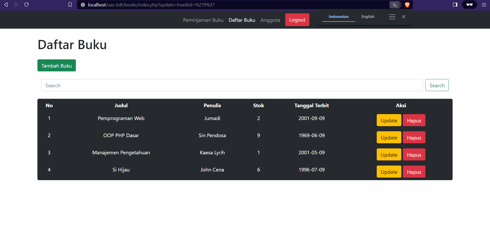

# Website Perpustakaan Online (UAS Basis Data Terapan)

Proyek Perpustakaan Peminjaman Buku ini bertujuan untuk memberikan solusi digital yang efisien dalam manajemen peminjaman dan pengembalian buku pada suatu perpustakaan.

---

## Anggota Kelompok

| NIM         | Nama Lengkap        | Github                                 |
| ----------- | ------------------- | -------------------------------------- |
| 32602200053 | David Dimas Santana | [@dadisan](https://github.com/dadisan) |

---

## Panduan Instalasi Aplikasi

Pertama `clone/download` dulu repository ini:

```bash
git clone https://github.com/dadisan/uas-bdt
```

Note: Pastikan anda sudah `menginstall git` pada komputer anda:

---

Setelah itu mengatur database:

Buka [PHPMyAdmin](http://localhost/phpmyadmin/) untuk membuat database `perpustakaan`.

Contoh perintah teriminal:

```sql
CREATE DATABASE perpustakaan;
```

```sql
USE DATABASE perpustakaan;
```

Buatlah `table`, `store procedure`, `function`, `view`, dan `trigger` dulu pada [PHPMyAdmin](http://localhost/phpmyadmin/). Anda dapat melihatnya pada file `\database\perpustakan.sql` pada repository ini:

- [perpustakaan.sql](./database/perpustakaan.sql)

---

Koneksikan `php` dengan `mysql`. Anda harus mengubah kode pada file `\util\connections.php` di repostiory ini.

- [connection.php](./util/connection.php)

```php
$HOST = "localhost"; // <- ubah ini pada connection.php
$USERNAME = "root"; // <- ubah ini pada connection.php
$PASSWORD = "dapid000"; // <- ubah ini pada connection.php
$DATABASE = "perpustakaan"; // <- ubah ini pada connection.php
```

---

## Panduan Penggunaan Aplikasi

### Login (Masuk sebagai staff perpustakan)

Login menggunakan `username` dan `password` sesuai dengan table `users` yang sudah dimasukan menggunakan kode sql:

```sql
-- menambahkan/memasukan/insert/input users
INSERT INTO
    users (username, `password`)
VALUES
    ("david", "rahasia"),
    ("dimas", "password");
```

| username | password |
| -------- | -------- |
| david    | rahasia  |
| dimas    | password |


### Menambahkan Anggota Baru

Untuk menambahkan anggota baru:

1. Tekan tab navigasi `Anggota`
2. Tekan tombol `Tambah Anggota` nanti akan di arahkan ke `Halaman Tambah Anggota`.
3. Isikan form input `Nama` dan `Email`
4. Tekan tombol `Tambah Anggota`
5. Jika muncul popup/modal konfirmasi, tekan `Daftar Anggota` untuk kembali ke `Halaman Daftar Anggota`, tekan `Tutup` tetap di `Halaman Tambah Anggota`.


### Melihat Daftar Anggota

Untuk melihat daftar anggota:

1. Tekan tab navigasi `Anggota` atau path url `/members/index.php`


### Mengubah Anggota

1. Tekan tombol `update` yang ada di kolom `aksi`
2. Terus isikan pada kolom `nama` dan `email` apa saja yang mau diupdate
3. Setelah mengisikan semua nya dan dirasanya semuanya sudah benar, selanjutknya tekan tombol `update anggota`


### Menghapus Anggota

1. Pilih Anggota mana yang akan dihapus
2. Lalu tekan tombol `Hapus` yang ada di kolom `Aksi`
3. Selanjutnya akan muncul pop up yang bertuliskan `Apakah anda yakin?`, kalau yakin tekan tombol `Ok` kalau tidak tekan tombol `Cancel`.


### Menambahkan Buku

1. Pertama kalian tekan tombol `Daftar Buku` pada navigasi
2. Terus tekan tombol `Tambah Buku` dan isi form yang disedian secara lengkap
3. Setelah mengisikan semua datanya, lanjut tekan tombol `Tambah Buku`
4. Lalu akan muncul pop up `Konfirmasi` tekan tombol `Daftar Buku`
5. Terus langsung saja akan diarahkan ke halaman `Daftar Buku`
6. Dan secara otomatis data buku nya akan langsung muncul.


### Melihat Daftar Buku

1. Tekan tombol `Daftar Buku` pada navigasi dan langsung muncul semua daftar buku yang ditambahkan


### Mengubah Buku

1. Tekan tombol `Update` pada buku yang mau diedit
2. Langsung isikan form data buku mana yang akan di edit datanya
3. Setelah semua sudah benar lalu tekan tombol `Update Buku`
4. Secara otomatis data akan terupdate.


### Menghapus Buku

1. Caranya sama seperti `update` tapi sebaliknya kalian tekan tombol `Hapus` pada data yang akan dihapus
2. Selanjutkan akan muncul pop up `Apakah anda yaki?` lalu tekan `Ok` untuk menghapusnya



### Memasukan Data Peminjaman Buku

1. Kalian pencet tombol `Peminjaman Buku` yang ada di navigasi atas
2. Lalu kalian tekan tombol `Pinjam Buku`terus isi form yang telah disediakan secara lengkap
3. Setelah semua data dimasukan tekan tombol `Pinjam Buku`
4. Dan akan muncul pop up `Konfirmasi` lalu tekan `Ok`
5. Secara otomatis data akan muncul di halaman `Peminjaman Buku`


### Memasukan Data Pengembalian Buku

1. Setelah meminjam buku lalu akan mengatur tanggal pengembaliannya
2. Caranya tekan tombol `Kembalikan`pada kolom aksi di Peminjaman buku
3. Lalu akan muncul pop up `Form Pengembalian Buku`
4. Setelah itu set tanggal pengembalian buku setelah itu tekan `Submit`
5. Datanya akan otomatis hilang dan masuk ke kolom `Lihat Semua Transaksi`


### Melihat Daftar Peminjaman Buku yang Belum Dikembalikan

1. Untuk melihat Daftar Peminjaman Buku yang belum dikembalikan , kalian cukup tekan tombol `Lihat Semua Transaksi` yang ada di Peminjaman buku
2. Terus akan muncul semua data daftar Peminjaman Buku yang belum di kembalikan


### Melihat Semua Daftar Peminjaman Buku

1.  Kalian tekan saja tombol `Peminjaman Buku` yang ada di navigasi utama
2.  Lalu secara otomatis akan muncul semua Daftar Peminjaman Buku di halaman tampilan awal `Peminjaman Buku`


### Menghapus Peminjaman buku yang telah dikembalikan

1. Kalian masuk saja ke halaman `Peminjaman Buku` lalu tekan tombol `Lihat Semua Transaksi`
2. Lalu pilih data mana yang akan di hapus
3. Terus tekan tombol `Hapus` di kolom aksi
4. Dan setelah itu akan muncul pop up `Konfirmasi Hapus` lalu tekan tombol `Hapus`
5. Setelah itu data akan terhapus.


